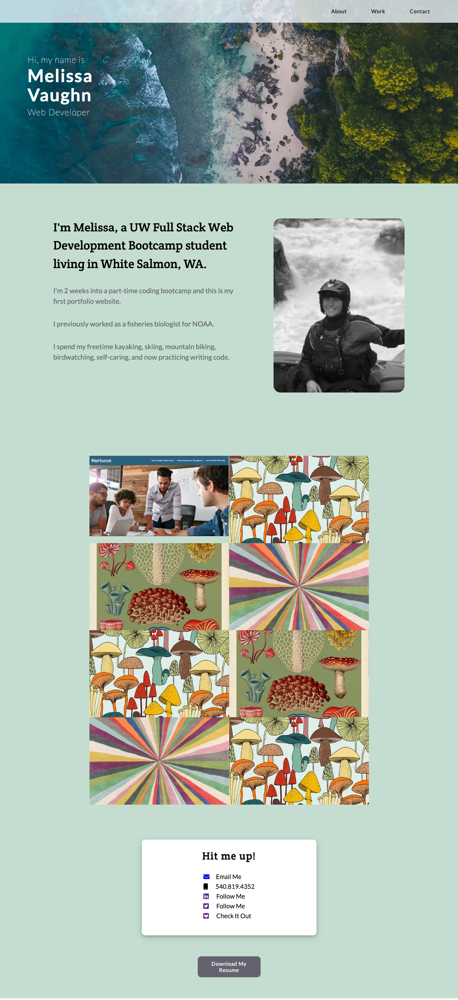

# Melissa Vaughn Web Developer Portfolio Webpage

## Description

This portfolio webpage was created to showcase my future web development projects as I progress through the UW coding bootcamp. This is just the first draft and will be updated as I gain skills and knowledge on developing web applications. 

## Installation

N/A

## Usage

To use this webpage you can either scroll to each section and view the content or click on the navigation links, which will direct you to the choosen section. 

## Credits

I used fontawesome for the icons in my contacts section. https://fontawesome.com/
I used Google Fonts for my two fonts. https://fonts.google.com/

## License

Please refer to the LICENSE in the repo.

